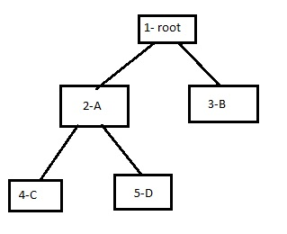
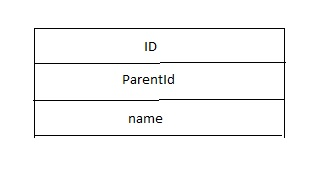
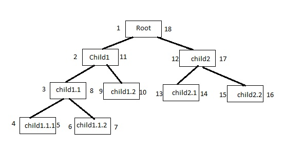
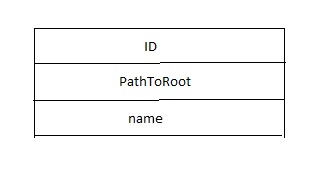

<H1><strong>Problem Definition</strong></H1> 
We in Amazing Co need to model how our company is structured so we can do awesome stuff.We have a root node (only one) and several children nodes, each one with its own children as well. It's a tree-based structure. Something like:
 

 
We need two HTTP APIs that will serve the two basic operations: 
<UL>
<li>Get all descendant nodes of a given node (the given node can be anyone in the tree structure).</li>
<li>Change the parent node of a given node (the given node can be anyone in the tree structure).</li>
</UL>
 
They need to answer quickly, even with tons of nodes. Also, we can't afford to lose this information, so some sort of persistence is required.
Each node should have the following info:
<UL>
<li>node identification</li>
<li>who is the parent node</li>
<li>who is the root node</li>
<li>the height of the node. In the above example, height(root) = 0 and height(a) == 1. </li>
</UL>
 
In Amazing Co our services are generally written in Java, built with Maven or Gradle, deployed as Docker images, and using Postgres for persistence. These are not hard requirements, but please document your decisions and tradeoffs.
It should be fast and easy to get your solution up-and-running for a developer that is new to your codebase.
 
 
<H1><strong>Possible Solutions</strong></H1> 
To store tree structure data in RDBMS database, there exist several solution:
<ol>
<li><strong>Adjacency list</strong> 
Each node store the ID of the parent node. root node doesn't have any parent. 
 

 
<strong>Advantages </strong> 
<ul>
<li>the most intuitive solution</li> 
<li>To change node parent, we should just change the parent reference of the node</li>
<li>Simple insert operation</li>
</ul>
<strong>Disadvantages</strong>
<ul>
<li>descendant of a given node required recursive selection of the database.</li>
<li>getting height of a given node required recursive selection of the database.</li>
</ul>
 
</li>
<li><strong>Nested sets</strong> 
The idea of this method is to store the prefix traversal of the tree. Here the tree root is visited first, then all the nodes of the left subtree are visited in the prefix order, then the nodes of the right subtree are visited once again in the prefix order. The order of traversal is stored in two additional fields: left_key and right_key. The left_key field contains the number of traversal steps before entering the subtree, while the right_key contains the number of steps before leaving the subtree. As a result, for each node its descendants have their numbers between the node’s numbers, independently of their depth level. 

 
<strong>Advantages </strong> 
<ul>
<li>allows fast and simple operations for selecting the node’s ancestors, descendants, their count and depth level, all without recursion</li> 
</ul>
<strong>Disadvantages</strong>
<ul>
<li>the necessity to reassign the traversal order when inserting or moving a node.</li>
</ul>
 

</li>
<li><strong>Materialized paths</strong> 
The idea of this method is to explicitly store the whole path from the root as a primary key for the node. 

 
<strong>Advantages </strong> 
<ul>
<li> intuitive representation of the data</li>
<li>allows fast and simple operations for selecting the node’s ancestors, descendants, their count and depth level, all without recursion</li> 
 
</ul>
<strong>Disadvantages</strong>
<ul>
<li>required string operations to insert and move of node</li>
<li>unbalanced tree will cause very long path</li>
</ul>
 
</li>
</ol>
<H1><strong>Chosen Solution</strong></H1> 
<strong>assumptions</strong> 
From the problem statements, we could assume:
<ul>
<li> First of all, our tree structure is nearly balanced, eg all nodes in the same depth, almost have equal descendants.</li>
<li> We need very fast response when selecting node descendants as it's the most use case that will happen.</li>
<li>Inserting new nodes happens frequently, but very less often comparing to the read operation.</li>
<li>Changing node's parent is the least frequent event, but it will happen sometimes.</li>
</ul>
<strong>Analyzes</strong> 
According to the assumptions, choosing the adjacency list would be the worst choice, because it will take most db operations when selecting descendants of a node or calculating height of a node. 
The NestedSet algorithm would response almost as equal as materialized path algorithm in read operation, but it will take more effort when we need to insert a new node, because we should re-travers the entire tree when we want to insert a single node or change a node's parent.  
<strong>Conclusion</strong> 
To solve our problem, I choose Materialized paths solution due to our problem requirements and also ease of implementation. 
<strong>Implementation</strong>
<ul>
<li>Three-Tier Architecture</li>
<li>DAO design pattern in persistence tier</li>
<li>To make APIs more intuitive, use Adjacency list in presentation tier and convert from Adjacency list to Materialized path in business tier</li>
</ul>

<H2>API Document</H2>
<H3>DTOs</H3>
<strong>NodeDto</strong>
<table>
<thead>
<th>Property Name</th>
<th>Type</th>
<th>Description</th>
</thead>
<tbody>
<tr>
<td>id</td>
<td>Integer</td>
<td></td>
</tr>
<tr>
<td>name</td>
<td>String</td>
<td></td>
</tr>
<tr>
<td>parent</td>
<td>NodeDto</td>
<td></td>
</tr>
<tr>
<td>height</td>
<td>Integer</td>
<td></td>
</tr>
</tbody>
</table>
 
<strong>RestResult</strong> 
All APIs return a unique data structure.
<table>
<thead>
<th>Property Name</th>
<th>Type</th>
<th>Description</th>
</thead>
<tbody>
<tr>
<td>errorCode</td>
<td>Integer</td>
<td></td>
</tr>
<tr>
<td>errorDescription</td>
<td>String</td>
<td></td>
</tr>
<tr>
<td>data</td>
<td>Template</td>
<td>Each API returns corresponding data type</td>
</tr>
</tbody>
</table>

 
<H3>Rest APIs</H3>
<H5>save</H5>
This end point would be used to store new nodes or change exsisting nodes in DB. We could also change the parent of each node with this end point. 
<strong>Hints</strong> 
<Ul>
<li>Root Node should be persisted First. To Store root, parent of input object should be null.</li>
<li>To store new nodes, ID of new node should be null and ID of the parent is mandatory.Other fields of parent are not required and will not be consideres.</li> 
<li>Heigth of input data will not be consideres</li>
<li>To change existing node(change name or parent), id of the node is mandatory.</li>
</UL>

<table>
<tbody>
<tr>
<th>HTTP Method</th>
<td>POST</td>
</tr>
<tr>
<th>End Point</th>
<td>IP:8585/rest/v1/node/save</td>
</tr>
<tr>
<th>Body Parameter</th>
<td>NodeDto</td>
</tr>
<tr>
<th>Response Data Type</th>
<td>NodeDto</td>
</tr>
</tbody>
</table>
 
<H5>descendant</H5>
This end point would be used to fetch all descendants of a given node, including the node itself. 

<table>
<tbody>
<tr>
<th>Http Method</th>
<td>Get</td>
</tr>
<tr>
<th>End Point</th>
<td>IP:8585/rest/v1/node/descendant/{id}</td>
</tr>
<tr>
<th>Url Parameter</th>
<td>id: Integer</td>
</tr>
<tr>
<th>Response Data Type</th>
<td>List&lt;NodeDto&gt;</td>
</tr>
</tbody>
</table>
 

<H5>all</H5>
This end point would be used to fetch all nodes. 

<table>
<tbody>
<tr>
<th>Http Method</th>
<td>Get</td>
</tr>
<tr>
<th>End Point</th>
<td>IP:8585/rest/v1/node/all</td>
</tr>
<tr>
<th>Response Data Type</th>
<td>List&lt;NodeDto&gt;</td>
</tr>
</tbody>
</table>
 

<H5>root</H5>
This end point would be used to fetch root. 

<table>
<tbody>
<tr>
<th>Http Method</th>
<td>Get</td>
</tr>
<tr>
<th>End Point</th>
<td>IP:8585/rest/v1/node/root</td>
</tr>
<tr>
<th>Response Data Type</th>
<td>NodeDto</td>
</tr>
</tbody>
</table>
 

<H2>Running Tests</H2>
<pre>
<code>
mvn test
</code>
</pre>

<H2>Creating Package</H2>
<pre>
<code>
mvn clean package
</code>
or to skip tests
<code>
mvn clean package -DskipTests
</code>
</pre>
upon successful execution, treestructure-1.0.jar will be created inside target folder.
<H2>Running standalone project</H2>
<pre>
<code>
cd target
java -jar treestructure-1.0.jar
</code>
</pre>
upon successful execution, the application would be started and will listen on port 8585.
<H2>Run with Docker</H2>
From root directory of the project, follow steps below:
 
  
<ol>
<li>Create Package 
<Pre>
<code>
mvn clean package -DskipTests
</code>
</Pre>
</li>
<li>Copy target jar file to docker folder 
Windows :  
<Pre>
<code>
copy target\treestructure-1.0.jar docker\treestructure-1.0.jar
</code>
</Pre>
Linux:
<Pre>
<code>
cp target/treestructure-1.0.jar docker/treestructure-1.0.jar
</code>
</Pre>
</li>
<li>Run Docker 
<Pre>
<code>
docker-compose -f docker/docker-compose.yml up
</code>
</Pre>
upon successful execution, the application would be started and will listen on port 8585.
</li>
</ol> 
<H2>How to Test</H2>
This project has been integrated with Spring openApi and swagger. To send request, point your browser to <a href="http://127.0.0.1:8585/api-test-ui.html">http://127.0.0.1:8585/api-test-ui.html</a>.
This will bring swagger-ui documentation page and you could be easily able to send request to application to test the rest APIs.

 
